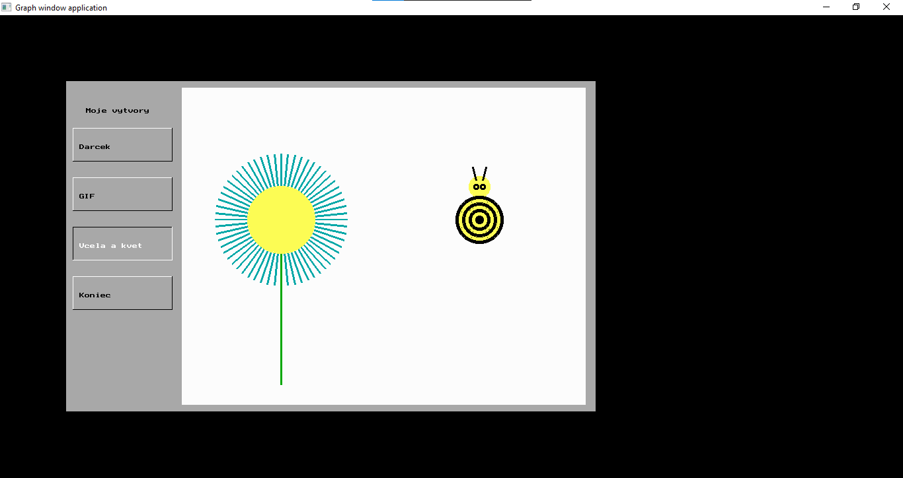

# Creative Creations in Pascal

## Overview

This Pascal program showcases various creative creations, including a gift box, a bee with a flower, and more. It utilizes the `graph` unit for graphical output and provides an interactive menu for exploring the different creations.

## Features

-   Menu-driven interface to explore creative creations.
-   Display of a gift box, a bee with a flower, and other imaginative designs.
-   Dynamic color and animation effects for enhanced visual experience.

## Getting Started

### Prerequisites

Before running the program, ensure that you have a Pascal compiler that supports the `graph` unit.

### Usage

1. Copy the program code into your Pascal environment.
2. Compile and run the program.

## Program Structure

The program is structured as follows:

-   `pozadie`: Procedure for creating a background with a specified color.
-   `tlacitka`: Procedure for drawing interactive buttons in the menu.
-   `menu`: Procedure for handling user interaction with the menu.
-   `platno`: Procedure for creating a canvas for drawing creative designs.
-   Creative designs: Procedures for drawing a gift box, a bee with a flower, and more.

## Screenshots

## Customization

Explore different designs by selecting options from the menu. Feel free to customize the code to add new creative elements or modify existing ones.

## License

This project is licensed under the MIT License - see the [LICENSE](LICENSE) file for details.
